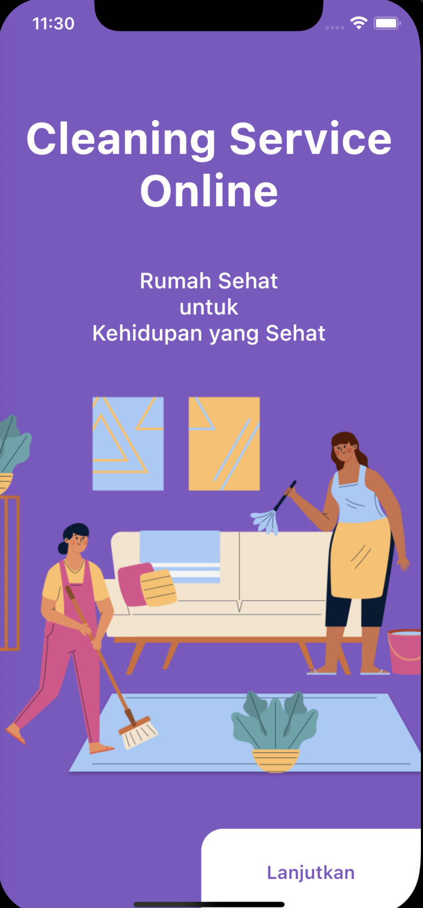
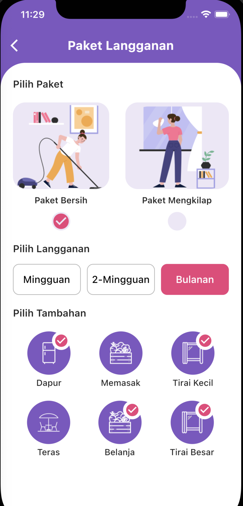

# Flutter Cleaning Service UI

Layouting the UI for Cleaning Service Online App

## Widget

- Stack
- MediaQuery
- BorderRadius
- Icon
- InkWell
- Navigator push
- Data Class
- Column
- Row
- Image Asset
- App Bar
- Stateful widget
- Stateless widget
- setState
- SizedBox
- Container
- Text
- TextStyle
- Scaffold
- SizedBox

## ScreenShot

| Home        | Detail    |
|--------------|-----------|
|  |       |

